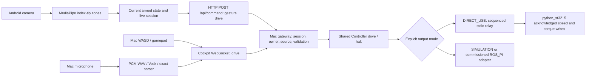

# T-BOT control-path audit

Audit baseline: commit `02bcace` (Add complete T-BOT mission control system). The user confirmed successful physical keyboard and joystick tests with the **USB adapter connected to the Mac and the motor Python program running on the Mac**. SSH is also used to access the Raspberry Pi. These are separate connections: an SSH login does not automatically carry browser motor commands.

This audit fixes the new Mission Control path, preserves the existing keyboard/gamepad mapping and motor signs, and distinguishes software verification from physical acceptance. See [the classroom guide](classroom-control-checklist.md) for executable startup steps and URLs.

## What the repository contains

| Area | Functions and implementation | Limits / prerequisites |
| --- | --- | --- |
| Legacy `/demo` page (`/` now redirects to Mission Control) | `components/tbot-dashboard.tsx`: original dashboard, WebSocket connection, WASD/manual buttons, camera preview, mock finger-count selector, browser speech recognition, placeholder telemetry | Separate `{command, speed}` protocol aimed at port 8000. Camera preview is not automatic hand recognition. Do not use it to validate the new gateway. |
| `/mission-control` | `components/mission-console.tsx`: current dashboard; keyboard drive, gamepad mapping/calibration, phone pairing, voice, control ownership, Stop, simulator/ROS mode selection, direct USB servo switch | Uses gateway on port 8001. Connect the actual USB motor output explicitly; virtual motion alone is not physical motion. |
| `/tablet` | `components/tablet-controller.tsx`: Android/local MediaPipe HandLandmarker, mirrored index-tip position, five-zone virtual joystick, 180 ms time-based dwell with diagonal hysteresis, confidence gate, camera FPS and direction telemetry, explicit arming | Requires browser camera permission and a secure context. No camera video is uploaded; direction/point/confidence are transmitted. This gesture vocabulary differs from the older Python camera program. |
| `/prototype` | `components/tbot-prototype.tsx`: standalone visual demonstration | Presentation/UI prototype, not the shared hardware gateway. |
| Gateway client | `lib/tbot/client.ts`: session creation, cockpit command/ack WebSocket, device telemetry, mobile HTTP commands, heartbeat/reconnection and REST library requests | Source/owner checks happen at the gateway. Only one source owns motion at a time. |
| Gateway API | `backend/app.py`: sessions, pairing QR, commands, direct servo process, runtime mode, devices, readiness, saved routes/maps/photos/settings, voice decoding, code runner, diagnostics | The process must run on the USB-owning computer for direct control. Starting the virtual adapter on a Mac is not an automatic network connection to Pi ROS. |
| Motion controller | `backend/controller.py`: claim/release, drive, stop, heartbeat timeout, command timeout, timed voice motion, odometry distance/angle tests, waypoint missions, pause/resume/retry/skip, return Home, frontier exploration | Physical autonomy needs fresh physical sensor/localization/calibration evidence. Direct USB mode exposes no invented map, pose, LiDAR or odometry and rejects measured moves and autonomy. |
| Voice recognition | `lib/tbot/audio.ts` and `voice-session.ts`; `/voice/transcribe`, `/voice/interpret`, `/voice/live`; parser in `backend/domain.py` | Offline English Vosk model must be installed on the gateway host. Transcript practice does not need a microphone/model. Live STOP monitoring runs during recording, not as an always-on microphone. |
| Virtual Lab | `backend/simulator.py`: workshop map, robot pose/odometry, LiDAR, battery, collision-aware navigation, home/mission progression, coverage, deterministic scenarios | Tests UI/planning/command flow without the robot. Does not measure real USB-driven motion. |
| Path planning | `backend/planner.py`: occupied/unknown cells, footprint clearance/inflation, grid search, checkpoint routes, validation, estimated length/time; map fingerprinting in domain | Depends on correct map and geometry. Real navigation additionally requires the ROS/Nav2 stack. |
| Persistence | `backend/storage.py`: SQLite documents/events, maps/images/YAML export, route/run/history/settings storage under `.tbot-data` | Local state is ignored by Git. Photos/maps and experiment results are not committed source. |
| ROS adapter | `backend/ros_adapter.py`: graph/topic discovery, scan/odom/map/battery/diagnostics, TF pose, manual velocity publication, Nav2 actions, map load, guard authorization | A local Python environment with compatible ROS 2 is required. Mac direct USB demo does not require this path. |
| ROS motor/guard | `backend/base_node.py`, `velocity_guard.py`, `motor_math.py`: wheel kinematics, servo output, encoder odometry and independent command/heartbeat/scan checks | Distinct SDK path from the working `python_st3215` controller. Must be commissioned with real geometry, directions, feedback and sensor data before use. |
| ROS bring-up | `backend/hardware.launch.py`, `navigation.launch.py`, config/URDF, shell scripts and systemd units | Ubuntu/Jazzy production assumptions, external sensor drivers, transforms, mapping/localization. Not a ready-made substitute for the already-working Mac setup. |
| Existing robot programs | `robot-code/t-bot_wasd.py`, `t-bot.gusture.py`, `t-bot.py`, `motor.rpm.py`: original terminal WASD, host-camera gesture control, two-servo check, distance/RPM calibration | The known physical behavior is the baseline. Hardware addresses, wheel signs and working interpreter are retained. |
| USB relay | `robot-code/dashboard_wasd_relay.py`: gateway velocities converted to the existing forward/back/left/right/stop motor commands, with a command watchdog | Runs on the Mac with the USB device and existing servo interpreter configured. The adapter must not be opened simultaneously by another controller. |
| Other robot examples | `robot-code/server.py`: HTTP connectivity check only. `robot-code/robot.py`: GPIO17 LED exercise. `dashboard_servo_bridge.py`: additional standalone servo bridge | The connection test deliberately has no motor output. These scripts are not interchangeable with the mission gateway. |
| Optional cloud/UI support | Firebase mission/photo sync and rules/tests; Drizzle/Cloudflare D1 starter; optional ChatGPT sign-in helpers; reusable UI components; responsive styles and build tooling | Not required for the four-control USB demo. Firebase needs explicit configuration/authentication; cloud sync is separate from robot control. |
| Code Runner | Dashboard chooses a local Python file, arguments, starts/stops it, shows recent output | Run only the intended experiment. A separate motor program can compete with the dashboard for the USB adapter; do not start both. |

## Hardware guide cross-check

The supplied *Ground-Up Mastery – Deep Study Edition* describes a Raspberry Pi 4B (4 GB), two ST3215-HS servos, a Waveshare Bus Servo Adapter, BNO055, and a four-wheel chassis with two driven diagonal channels and two passive wheels. YDLIDAR X2 is a high-confidence identification in the guide, not a physically reverified label. It also describes the HW-688 power converter and separate servo/logic power considerations.

Important evidence boundaries from the guide (especially pages 20–25, 132, 286–289): differential-drive kinematics approximate this four-wheel robot because it scrubs during turns; physical dimensions and calibration matter. Exact powered diagonal, servo IDs, battery label, red-button function and some components remain hardware-verification items in the PDF. Repository defaults are code settings, not new physical measurements.

The PDF describes the BNO055 I²C connection; the production launch file configures a UART driver/device. This is an unresolved full-ROS bring-up mismatch. No guessed wiring change was made. It does not explain a phone-only failure when the same Mac USB path already drives successfully with keyboard/gamepad.

## Confirmed defects and repairs

| Defect | Reproduction / consequence | Repair |
| --- | --- | --- |
| Tablet camera loop captured initial `armed=false` | Executing the original production callback after a later React render with `armed=true` produced six forward telemetry frames and **zero movement commands** | Persistent tablet control state reads current authority and gateway callbacks each frame. Regression executes the real camera callback. |
| Camera callback retained the old session/send function | A simulated reconnect kept sending through the original callback | Latest gateway reference on every frame; a changed/disconnected session disarms and requires a fresh request. |
| Automatic tablet claim undid Stop | The prior effect retried claim whenever camera+connection were available and armed was false | Explicit **REQUEST GESTURE CONTROL**; no automatic rearm. Late claim/drive responses release their own session, without stopping a new keyboard operator. |
| Frozen frames/detector errors could leave stale intent | A camera can remain open while frames stop advancing; a requestAnimationFrame error can terminate the loop | Stale-frame and failure handling stop/disarm; lost/uncertain hands immediately produce zero drive. |
| Phone camera-start button was covered | In a 430 px-wide browser, the gesture status overlay intercepted clicks on **START CAMERA** | Show the readout after the camera starts and compact the mobile camera setup layout. Normal button clicks now start the camera in the phone-size browser test. |
| Voice timed motion never reached the direct USB output | All four original timed-voice regression cases left the fake USB bridge at `(0, 0)` because only HTTP/WS `drive` was mirrored | Shared controller drive/halt output serves keyboard, gamepad, phone HTTP and timed voice; parser/ack alone is no longer mistaken for motor delivery. |
| Output exceptions left motion intent or another output active | A failed Stop retained timed-motion intent; a partial delivery failure could leave the other adapter moving | Clear controller intent before Stop I/O and roll back partial delivery. Repeated Stop errors cannot terminate the controller ticker or skip relay cleanup. Failure-injection regressions cover these cases. |
| Direct bridge was Linux-only | `/dev/ttyACM0`, hard-coded Linux environment paths and GNOME Terminal cannot launch the user's Mac USB controller | Portable `TBOT_SERIAL_PORT` (legacy `TBOT_SERVO_PORT`) / `TBOT_SERVO_PYTHON`, managed stdio relay on Mac/Linux, startup/readback/error reporting and preserved motor signs. |
| FIFO EOF skipped the motor watchdog | Original relay fake-motor regression remained moving after its writer disconnected | Stop on established-writer EOF; stdio/legacy FIFO have disconnect coverage. |
| Buffered pipe input delayed a queued Stop | `TextIOWrapper.readline()` could buffer a second command while `select()` reported no descriptor data, leaving a burst's Stop unread | Read bytes directly with `os.read()`, retain partial lines and process every complete command. Fake-motor burst tests cover the unchanged four direction mappings followed by Stop. |
| Live voice WebSocket was not covered by `/api/ws` proxy | Phone/private HTTPS uses `/api/voice/live`, a different WebSocket path | The complete `/api` gateway proxy supports WebSockets; HTTPS URL conversion explicitly produces `wss:`. |
| Worker development plugin closed the proxied voice socket | With Cloudflare Vite plugin 1.37.1, direct gateway port 8001 returned voice `ready`, but `/api/voice/live` on 5173 closed with code 1006 after acceptance; the plugin's catch-all upgrade listener also handled the proxied connection | Portable development uses Vinext's Node runtime so the gateway proxy owns its sockets. Production builds and managed hosting retain the Worker plugin. Browser verification now receives live voice `ready` through `/api`. |
| Vosk pin prevented Mac setup | Real dependency installation rejected `vosk==0.3.45`; its published wheels exclude macOS | Vosk 0.3.44 for Darwin, 0.3.45 for other supported hosts. |
| Late speech processing could execute after Stop/mode change | Permission/transcription/claim promises outlive button presses and control changes | Cancellable voice-session generations; cancel/Stop/disconnect/takeover discards pending work. A late voice claim cannot issue a global Stop against the newly selected keyboard source. |
| Microphone startup could lose the live voice session | Browser permission can take longer than the server's original first-packet timeout | Longer bounded wait for the first audio packet; normal stream/duration limits remain. |
| Microphone resource leak after AudioContext failure | Camera/mic permission can succeed before Web Audio initialization fails | Release acquired tracks on setup failure, bounded recording, tested PCM16 mono 16 kHz WAV conversion. |
| Mobile heartbeat requests overlapped | A 500 ms interval could initiate another 900 ms request, then competing failures reconnect multiple sessions | Serialized heartbeat scheduling; mobile command/heartbeat response bodies included in request deadline. |
| Minor deployment blockers | Sensor direct-script import missed repo root; Tailscale launcher was Linux-amd64-specific and used old Serve syntax | Correct import root; installed/macOS Tailscale CLI and explicit current Serve paths. No production services were started. |
| ROS-only graph/planner blockers | Known wheel+filtered odometry graph was treated as ambiguous; Jazzy planner plugin string used old separator | Deterministic known-topic selection with explicit override; corrected plugin identifier. These fixes are not physical navigation certification. |

## Exact active data path



Phone telemetry (`/device-state`) is a separate branch used to draw the command map. A visible FORWARD label proves detection and that HTTP path, not arming or motor delivery. The phone must be explicitly armed, source/owner checks must accept the command, and Direct Servo must report a working process on the Mac.

The relay preserves the existing four-direction mapping and raw speed (1000). It is discrete control: small velocity magnitudes in the UI do **not** mean proportionally smaller raw USB motor speed. Do not infer physical metres/second from the virtual map. The physical speed/direction/stopping distance must be verified with the unchanged controller in class.

## Voice behavior and boundaries

Basic forward/back/left/right phrases become bounded five-second `timed` commands. Stop/cancel becomes Stop. The parser also supports Home, mission, exploration and measured distance/angle commands, but those need the appropriate physical feedback/readiness and are rejected on direct USB without measured odometry. Unknown phrases fail with no motion.

The newer dashboard uses offline Vosk, not the older page's browser SpeechRecognition service. Finishing a recording transcribes and immediately executes a recognized command; there is no separate approval step. Test in the simulator first and inspect the resulting transcript and motion. Live spoken STOP is recognized while recording. The on-screen Stop and Esc remain available independently of recognition.

Actual downloaded Vosk was checked with a generated local mono PCM16/16 kHz sample: the real transcription endpoint returned `forward` and the parsed `timed` command. A separate browser fake-microphone test exercised WebAudio capture, PCM/WAV encoding, actual Vosk transcription, voice claim, timed motion and Stop. The actual browser also received the live voice `ready` handshake through the dashboard's `/api` proxy. This checks software/audio/model compatibility; it does not measure recognition accuracy in classroom noise or with the user's microphone/accent. The health endpoint's `voice_ready` flag reports model-directory presence; live connection/transcription must also verify that the decoder can load it.

## Verification and remaining classroom facts

Run the repeatable offline suite from the repository root:

```bash
node scripts/tbot-check.mjs
```

Or `npm run test:controls` if npm is available. It runs the gesture classifier checks, tablet production-callback/lifecycle tests, voice lifecycle/audio/transport tests, the backend fake-motor/simulator/API/ROS-discovery tests, and TypeScript checking. No serial device is opened by these tests. For build verification: `node scripts/run-framework.mjs build`.

An optional real-browser suite is available when Playwright and Chrome are already installed. Start the virtual gateway and dashboard as in the classroom guide, leave Direct Servo off, then run:

```bash
node scripts/tbot-browser-tests.mjs
```

It defaults to the `playwright` module, Chrome (`TBOT_BROWSER_CHANNEL=chrome`) and the local dashboard (`TBOT_TEST_URL=http://127.0.0.1:5173`). If Playwright is supplied by another installed runtime, set `TBOT_PLAYWRIGHT_MODULE` to that module's absolute entry-point path. No browser dependency installation is required for the base `tbot-check.mjs` suite.

Set optional `TBOT_TEST_VOICE_WAV` to a known-good WAV that says `forward`, with 0.5 seconds of leading silence and 7 seconds of trailing silence, to include the fake-microphone speech test. This fixture is replayed through Chrome's fake audio input; it does not record the user's microphone. Without the fixture, use the typed-voice and lifecycle regressions plus the classroom microphone procedure.

Confirmed software results for this audit:

| Check | Result |
| --- | --- |
| Gesture classifier assertions | 15 passed |
| JavaScript tablet, voice, lifecycle and transport tests | See final verification checkpoint below |
| Python gateway, fake-motor relay, simulator and mocked ROS tests | See final verification checkpoint below |
| TypeScript | Passed |
| Production build | Passed |
| Targeted lint | 0 errors; hook dependency, unused legacy state and image-element warnings remain |
| Actual Chrome dashboard with simulated keyboard/gamepad inputs | Drive and release-to-stop passed |
| Actual Chrome typed voice and gateway voice socket | Timed command/Stop and proxied live `ready` passed; zero browser errors in this run |
| Generated PCM WAV through the real Vosk transcription endpoint | Transcript `forward`; parsed action `timed` |
| Actual Chrome fake microphone through WebAudio and real Vosk | Encoded audio → transcript `forward` → voice claim/timed command → Stop passed |
| 430 px phone-size browser, fake camera and synthetic hand landmarks | Normal camera-start click passed. Disarmed detections sent no motion; explicitly armed forward/back/left/right/zero reached the real HTTP gateway; no hand sent zero; Stop prevented automatic rearm. Zero page errors. |
| 360 px phone-size browser with actual MediaPipe CPU/WASM and model | Model and detector loaded; explicit arming on a fake no-hand stream remained stopped |

The browser checks use a running virtual gateway and synthetic inputs. The directional phone-size test passes synthetic MediaPipe landmarks and fake camera frames through the production camera callback and the actual HTTP gateway. A separate test loads the actual MediaPipe detector/model using a fake no-hand stream. Neither establishes recognition of a real hand, behavior on an actual Android device or physical motor response. The portable development server now uses Vinext's Node runtime for gateway WebSockets. Optional Cloudflare D1/R2 emulation belongs to the Worker build/preview or managed hosting flow; the Mac robot gateway continues using its own SQLite store.

The known-working original keyboard/joystick programs, button/axis mapping, four-direction signs and raw motor speed were not remapped. Mock/API tests verify their shared output alongside gesture/voice. The optional SDK is now installed in `.venv-tbot` and pinned in `backend/requirements-direct-usb.txt`. Physical confirmation still requires the actual USB adapter; fake serial tests cannot establish wiring, torque, port permissions, encoder calibration, or braking distance.

Remaining classroom checks are: the verified Mac serial device and servo firmware/response configuration; actual controller mode/mapping; Android/browser permissions and private-network routing; real USB behavior after disconnect; and full ROS sensor wiring/TF/localization readiness if autonomy is pursued. Saved gamepad mapping effect churn and mixed trigger-axis/controller modes were noted during the wider audit but not remapped in this gesture/voice repair, because the user confirmed the current joystick path works. Revisit only with the exact controller's observed axis/button values.


## Current continuation: custom motor output and safety

Only this customized checkout was audited. No conclusion depends on the original MyEquation `tbot_firmware/four_wheeled_diff.py`, and that repository was not modified. Before continuing, the 32 then-modified/untracked source files were copied with SHA-256 manifest and tracked diff to `/private/tmp/tbot-preserved-20260918-125627`. Current user work remains uncommitted. The pre-existing `package-lock.json` changes were preserved without modification.

### Actual motor path

`/tablet` sends gesture velocities by authenticated HTTP; keyboard/gamepad use the cockpit WebSocket; voice capture becomes mono PCM16/16 kHz WAV, Vosk transcription and a deterministic `timed` command. All reach `app.command_result` → `Controller.execute` → shared `Controller.drive/halt` → `DirectServoBridge.send` → managed `dashboard_wasd_relay.py` → `OwnedST3215` → `python_st3215` 1.2.1 → ST3215 serial packets. Voice movement is emitted on controller ticks through the same output. Device telemetry and API acceptance are separate from motor delivery.

The backend authorizes a session/source, validates finite bounded values, and issues a 750 ms permit bound to a boot epoch and control generation. The client adds monotonically increasing session sequence numbers. Stop/cancel bypass authority/freshness requirements, clear intent before I/O, invalidate permits and require a new explicit claim. Duplicate Stop executes again. Cached command replies no longer resurrect old authority or claim new hardware output. Runtime changes and reconnects also stop and invalidate prior authority.

The pipe packet contains `linear`, `angular`, `seq` and a host-monotonic `expires_at` (250 ms from send). The relay validates it, selects one of the original four directions, and writes both speed registers followed by torque enable. Each refreshed motion verifies acknowledgements from both motor IDs. It checks response ID, error byte and checksum; the SDK can return `None` on silence without raising, so a successful Python call alone was insufficient. Successful relay events are exposed separately as `last_motor_write`; UI/API text does not equate these with observed wheel movement.

| Direction | Right ID 1 | Left ID 2 |
| --- | ---: | ---: |
| Forward | +1000 | -1000 |
| Backward | -1000 | +1000 |
| Left | +1000 | +1000 |
| Right | -1000 | -1000 |
| Stop | Torque off, stored speed 0 | Torque off, stored speed 0 |

These are the existing relay signs and speed, verified against source and actual SDK packet encoding with serial mocked. The legacy WASD/test programs retain their separate speed 10000 and the Python camera program retains 1200. No global speed normalization was applied. USB control is discrete; dashboard velocity magnitude/gamepad power is not a calibrated physical speed limit. The ROS profile's raw-speed limit belongs to the separate ROS path.

### Confirmed new defects fixed

- This checkout's gateway virtual environment could not import `python_st3215`. The optional dependency is now installed locally and pinned reproducibly; `TBOT_SERVO_PYTHON` can still select a known working external environment.
- Linux device/terminal assumptions were replaced by one managed stdio path on Mac/Linux. Discovery reports USB metadata. It opens an explicit verified port, or exactly one match for both configured VID/PID filters; it never silently treats a lone unidentified USB sensor as the servo adapter.
- All repository motor entrypoints now acquire a per-device kernel lock before SDK open. macOS tty/cu aliases and symlinks share ownership. Errors identify the cooperating owner's PID/purpose. The actual SDK exposes `bus.ser`, so OS serial exclusivity is requested too. Unmodified programs and privileged processes can bypass cooperative protection; do not run competing tools.
- The relay previously wrote EEPROM mode repeatedly and did not verify acknowledgement. Startup now torque-disables both IDs, clears stored speeds, reads mode, and unlocks/writes/relocks EEPROM only if mode is not 1. Readback must confirm 1. Mode is an EEPROM setting; this implementation does not require an unconditional reboot, but actual firmware persistence/power-cycle behavior is a classroom check.
- Stop now attempts both torque-off writes and both zero-speed writes even if one fails, clears stale stored speed before a later enable, and reports failure. It preserves the prior torque-off behavior. Torque-off is release, not a measured active brake.
- Malformed/missing/nonfinite axes, unsupported actions and stale/reordered/deadline-expired pipe motion fault the relay. EOF and orderly SIGTERM attempt Stop. A failed/exited relay cannot auto-restart or replay motion; reconnect is explicit and starts stopped.
- Source/mode state is now explicit: SIMULATION, DIRECT_USB, ROS_PI. Direct USB reports no fake sensors. `/` redirects to Mission Control; the old mock dashboard is explicitly `/demo`.
- Pairing links use live `Self.DNSName`, including when created from localhost. Codes last five minutes, are single-use, and failed attempts are rate-limited. QR images use header authentication; bearer tokens are not in URLs. Phone refresh resumes by rotating its stored session token and requires rearming.
- Camera direction dwell uses elapsed time, not frame count. Loss of hand/confidence stops immediately; hidden page, camera failure and rotation disarm. Server authority loss updates the retained camera loop without automatic claiming.
- Voice capture is bound to the control version at its start. A delayed transcript cannot claim after external Stop/mode change: only that phrase's own sequential acknowledged Stop/claim transitions may advance its intent. Local cancellation and live voice-link failure also discard pending work and Stop.

### Timeouts, failure evidence and physical limits

| Layer | Bound / tested behavior |
| --- | --- |
| Gateway manual drive | Nonzero drive expires after 250 ms; 50 ms ticker adds scheduling latency. Latches disarmed. Neutral key/deadman release preserves selected control. |
| Gateway operator heartbeat | One second; armed idle sessions also expire. |
| Server command permit | 750 ms on server monotonic time; old epoch/generation/sequence rejected. |
| Pipe packet freshness | 250 ms deadline; expired nonzero output faults instead of moving. |
| Relay watchdog | 300 ms without motion refresh; 50 ms poll plus serial/scheduling latency. Stops, faults and exits. |
| Bridge confirmation | Missing relay write confirmation after 450 ms faults and closes the pipe. |
| Camera | Immediate zero for missing/low-confidence hand; frozen video closes/disarms after 750 ms. Backend/relay watchdogs cover the earlier lack of drive refresh. |
| Voice | Plain direction is bounded to five seconds, interrupted by Stop/disconnect. Live spoken Stop operates during recording, not as an always-on microphone. |

Delayed FORWARD after Stop, expired permits, out-of-order sequences, old boot state, reconnect without rearm, source transitions, partial motor errors, wrong/missing ACKs, FIFO bursts, malformed packets, ownership contention and USB-loss simulations are covered. Actual relay subprocess SIGTERM/writer EOF produce both mocked Stops; SIGKILL faults the bridge and prevents replay.

**A killed/frozen relay or failed host cannot transmit a physical Stop; an unplugged adapter cannot transmit one either.** The software cannot guarantee that powered servos stop after those events. A verified servo-side watchdog or independent power cutoff is required for that guarantee. None is assumed from this code. Wheels-up acceptance must measure torque-off coasting/stopping distance, actual ACK/firmware behavior and power-cycle recovery. These limitations are not reported as fixed by mock tests.

### Exact changed files

The inventory below includes work preserved from the preceding run and this continuation. `package-lock.json` is listed as pre-existing user work and was not edited in this continuation.

- `.node-version`
- `README.md`
- `app/demo/page.tsx`
- `app/page.tsx`
- `app/tablet/tablet.css`
- `backend/app.py`
- `backend/base_node.py`
- `backend/config/tbot_nav2.yaml`
- `backend/controller.py`
- `backend/domain.py`
- `backend/network.py`
- `backend/requirements-direct-usb.txt`
- `backend/requirements.txt`
- `backend/ros_adapter.py`
- `backend/serial_owner.py`
- `backend/tests/test_api.py`
- `backend/tests/test_classroom_launcher.py`
- `backend/tests/test_control_delivery.py`
- `backend/tests/test_controller.py`
- `backend/tests/test_direct_servo_bridge.py`
- `backend/tests/test_motor_end_to_end.py`
- `backend/tests/test_motor_process_failures.py`
- `backend/tests/test_network.py`
- `backend/tests/test_ros_topic_selection.py`
- `backend/tests/test_safety_protocol.py`
- `backend/tests/test_serial_owner.py`
- `backend/tests/test_servo_relay.py`
- `backend/tests/test_simulator.py`
- `backend/usb_transport.py`
- `components/mission-console.tsx`
- `components/tablet-controller.tsx`
- `docs/classroom-control-checklist.md`
- `docs/tbot-audit.md`
- `lib/tbot/audio.ts`
- `lib/tbot/client.ts`
- `lib/tbot/command-proof.ts`
- `lib/tbot/tablet-control.ts`
- `lib/tbot/tablet-gesture.ts`
- `lib/tbot/transport.ts`
- `lib/tbot/voice-session.ts`
- `package-lock.json` — preserved pre-existing lockfile change; not edited in this continuation.
- `package.json`
- `robot-code/dashboard_servo_bridge.py`
- `robot-code/dashboard_wasd_relay.py`
- `robot-code/motor.rpm.py`
- `robot-code/t-bot.gusture.py`
- `robot-code/t-bot.py`
- `robot-code/t-bot_wasd.py`
- `scripts/tbot-browser-tests.mjs`
- `scripts/tbot-check.mjs`
- `scripts/tbot-classroom.py`
- `scripts/tbot-classroom.sh`
- `scripts/tbot-pi-launch.sh`
- `scripts/tbot-sensors.py`
- `scripts/tbot-tablet-tests.mjs`
- `scripts/tbot-tailscale-dev.sh`
- `scripts/tbot-voice-tests.mjs`
- `vite.config.ts`

## Final software verification checkpoint

- Baseline `02bcace`; the current local working tree is the result. No commit, push, reset, restore, stash or cleanup was performed.
- `node scripts/tbot-check.mjs`: **15 classifier assertions, 56 JavaScript lifecycle/voice/transport tests, 289 backend tests, and TypeScript passed**.
- Real Chrome suite: **9 checks passed**, including keyboard, deadman gamepad, all synthetic gesture directions through the real HTTP gateway, actual MediaPipe/WASM loading, actual private Tailscale HTTPS pairing from localhost, single-use rejection and session refresh, real Vosk generated-WAV recognition and browser fake-microphone voice execution. No uncaught application errors.
- Actual subprocess and SDK evidence: 16 four-source/four-direction cases reach the real child relay using an isolated fake SDK; separate tests run installed SDK 1.2.1 against mocked serial bytes. Signals, pipe EOF, ownership conflicts and SDK failures are injected without opening hardware.
- Stop during input-source selection also cancels its pending claim; controller selection preserves its prior keyboard/gamepad mappings.
- Production build passed; targeted ESLint returned **0 errors / 20 warnings** (hook dependencies, retained legacy state and image-element guidance). Dependency deprecation and build chunk-size warnings are non-blocking and retained explicitly.
- Launcher actual start, compatible-process reuse, verified stop and clean restart passed on this Mac with Node 26.8.2. Node 24.19.0 remains the earlier tested pin. Both services report this checkout/protocol, and `/api/health` reaches the same backend. Private hostname is discovered at runtime; no source-file hostname is hard-coded.
- The report and classroom guide distinguish software evidence from physical results. No robot/serial adapter was connected by these verification runs. The current USB port, firmware response configuration, hand-recognition performance on Android and motor stopping behavior still require the wheels-up procedure.

## Sources

- User's attached `TBOT_Ground_Up_Mastery_Deep_Study_Edition.pdf` (hardware reference; source is unchanged).
- [MDN camera/microphone secure-context requirements](https://developer.mozilla.org/en-US/docs/Web/API/MediaDevices/getUserMedia).
- [Vite WebSocket proxy configuration](https://vite.dev/config/server-options#server-proxy).
- [Vosk release distributions](https://pypi.org/project/vosk/) and [macOS packaging issue](https://github.com/alphacep/vosk-api/issues/2013).
- [Tailscale Serve](https://tailscale.com/docs/reference/tailscale-cli/serve).

- [python-st3215 1.2.1 release](https://pypi.org/project/python-st3215/1.2.1/) and its installed SDK source (actual packet encoding/response semantics checked with serial mocked).
- [Waveshare ST3215 manual](https://files.waveshare.com/upload/f/f4/ST3215_Servo_User_Manual.pdf), page 16: torque release is distinct from Stop; this audit does not equate release with measured braking.
